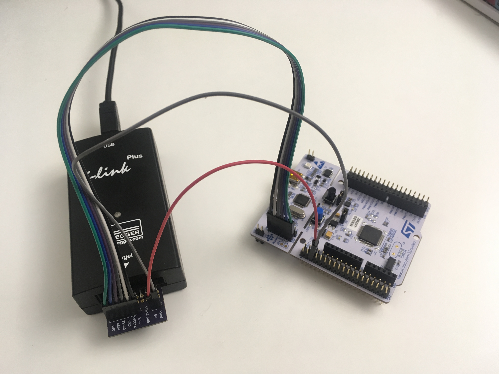

# ARM Cortex STM32 Adapter

A simple adapter to connect STM32 development boards like the STM32 Nucleo or the STM32 Discovery boards to a JTAG/SWD tool like SEGGER's J-Link.

While ST Micro provides a firmware update that converts the built-in ST/Link program adapter in a J-Link, it's easier to just use your regular JTAG/SWD adapter without making any modification. 

The adapter can be directly plugged into the [20-pin JTAG interface](https://www.segger.com/products/debug-probes/j-link/technology/interface-description/).
. On the other side, the 6-pin header JP2 can be connected to the SWD interface of the STM32 board. Most JTAG/SWD tools requires a connection to the target VDD as well, which can be provided via JP3. Finally, the J-Link provides a 5V output, which can be used to power the dev board as well (please check documentation about how to configure this)

It is can be directly [ordered at OSHpark](https://oshpark.com/shared_projects/92vOWrue)

